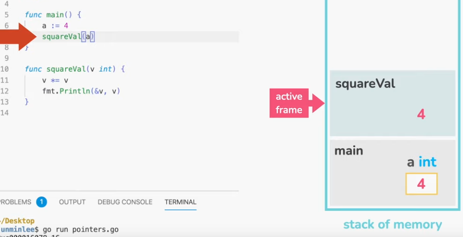
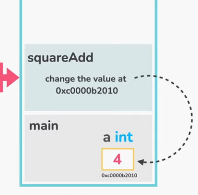
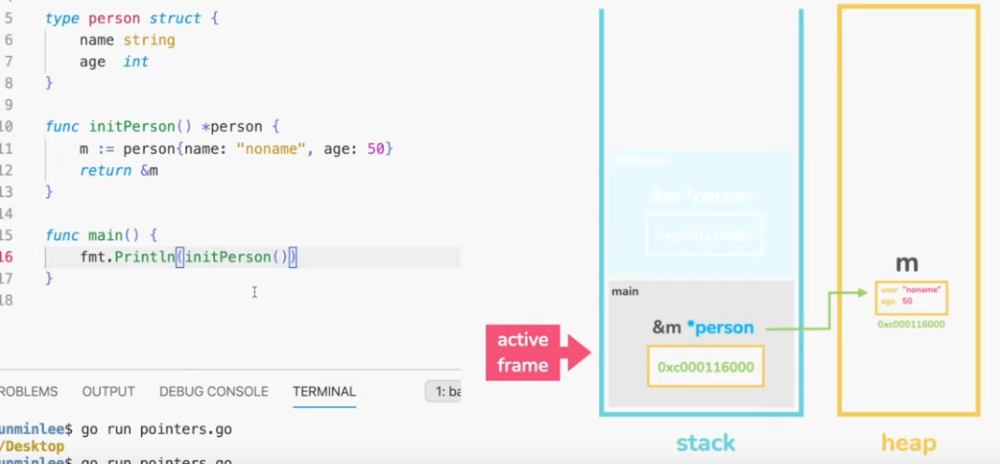

# Golang stuff from various resources

<!-- START doctoc generated TOC please keep comment here to allow auto update -->
<!-- DON'T EDIT THIS SECTION, INSTEAD RE-RUN doctoc TO UPDATE -->
**Table of Contents**

- [Overview / motivation](#overview--motivation)
- [Ressources](#ressources)
- [Project Structure](#project-structure)
- [Setup](#setup)
- [Packages](#packages)
  - [Imports](#imports)
  - [Using 3rd party packages](#using-3rd-party-packages)
  - [Creating own packages](#creating-own-packages)
- [General syntax and other notes](#general-syntax-and-other-notes)
- [Variables](#variables)
  - [Declaration](#declaration)
  - [Variable scope / visibility](#variable-scope--visibility)
  - [Naming conventions](#naming-conventions)
  - [Casting](#casting)
- [Primitive datatypes](#primitive-datatypes)
  - [numeric](#numeric)
    - [Integer types](#integer-types)
    - [Decimal types](#decimal-types)
- [Functions](#functions)
- [Arrays and slices](#arrays-and-slices)
- [Slices](#slices)
- [Conditionals](#conditionals)
- [Loops](#loops)
- [Maps](#maps)
- [Range](#range)
- [Pointers](#pointers)
- [Closures](#closures)
- [Structs](#structs)
  - [Values](#values)
  - [Methods](#methods)
  - [Factories](#factories)
- [Interfaces](#interfaces)
- [Generics](#generics)
- [Error handling](#error-handling)
  - [pkg/errors](#pkgerrors)
  - [Panic and recover](#panic-and-recover)
    - [Panic](#panic)
    - [Recover](#recover)
- [Web](#web)
- [Golang for REST APIs: gin vs mux](#golang-for-rest-apis-gin-vs-mux)
- [Concurrency](#concurrency)
  - [Goroutines](#goroutines)
  - [Channels](#channels)

<!-- END doctoc generated TOC please keep comment here to allow auto update -->

## Overview / motivation

- Strongly (type can't be changed after declaration) and statically (types have to be defined at compile time) typed
- Strong community
- key features:
    - simplicity (which also means less features that would add complexity)
    - fast compile times
    - fast garbage collection
    - built-in concurrency
    - compiles to standalone libraries (no external runtime or libraries needed)
- focused on server applications (no UI libraries)

## Ressources

- https://go.dev/ including a little in-built [IDE](https://go.dev/play/)
- Documentation: https://go.dev/doc/
- https://go.dev/doc/effective_go required reading for serious development
- https://pkg.go.dev/std Package documentation
- [go forum](https://forum.golangbridge.org/categories)
- https://gobyexample.com/ (concise explanations with code for everything covered here)
- https://go-proverbs.github.io/

## Project Structure

Global GOPATH (usually under `~/go`) contains:

- src/: location of Go source code (for example, .go, .c, .g, .s).
- pkg/: location of compiled package code (for example, .a).
- bin/: location of compiled executable programs built by Go.

## Setup

Install and put bin path in `~/.bashrc`: `export PATH=$PATH:/usr/local/go/bin` (default go path on linux).

Don't define `GOROOT`, as go will figure it out from its own location, and it can lead to problems with multiple go versions.

`GOPATH` is a monolithic directory where packages and binaries are stored, similar to a global `node_modules`. Packages go to `~/go/pkg`, binaries to `~/go/bin`.

If no GOPATH is defined, `~/go` is assumed, otherwise define GOPATH in `.bashrc` as well.

Multiple GOPATH paths can be defined, e.g. `/home/pk/go:/home/pk/projects/go/helloworld`

The *first* path is where libraries are installed, but all paths will be *searched* when looking for libraries.

I guess the IDE should take care of this for projects.

https://www.digitalocean.com/community/tutorials/understanding-the-gopath

*Deprecated*: Libraries can be installed (globally) using `go get`, e.g. `go get github.com/nsf/gocode`

'go get' is no longer supported outside a module.

**Update**: "new" way to install global libs / binaries: `go install  github.com/nsf/gocode@latest`

A go workspace is any folder with a `src` subfolder. Other (generated) ones are `bin` and `pkg` just as in the monolithic `~/go`path.

## Packages

Every go program ist structured into packages. Every file needs to be part of a package. The package `main` is the entrypoint of the application.

`package main`

### Imports

Syntax (no comma!):

    import(
      "fmt"
      "math"
    )

or optionally `import "fmt"` if only one library is used.

All imports have to be used somewhere in order for the program to be compiled.

### Using 3rd party packages

Problem: We want to use a 3rd party package, e.g. hosted on GitHub. We *don't* want to use `go get -u github.com/gorilla/mux` to install the package globally on the system.

1) *Turn off "optimize imports" as a save action in IntelliJ as otherwise they will be removed, so go can't analyze which packages are needed (is that really the way to go?)*
2) include the package needed in `main.go` (or wherever it is needed), e.g. `import "github.com/gorilla/mux"`
3) In the projects' folder (where `main.go` is located, run `go mod init [url or fake url to project]`, e.g. `go mod init example.com/packages`
4) run `go mod tidy` to add module requirements and version numbers inferred by the imports to the `go.mod` file and also adds a `go.sum` file with version numbers and sub-dependencies.
5) When removing imports, re-run `go mod tidy` to remove them from the `go.mod` and `go.sum` files.

This can be thought of `npm init` (= `go mod init`) and `npm install` (=`go mod tidy`).

### Creating own packages

1) Make sure the project using the module itself was initialized as a module like we did above.
2) add a folder and code with the package name in the projects directory, e.g. `strutil/strutil.go`; *remember that only functions and variables with an *U*ppercase first character are exported*
3) Add the package name to be used at the top in `strutil.go`: `package strutil`. It is probably best to keep the packages directory name, file name (if there's only one) and package name the same
4) use the *same url* used to initialize the project to import the package: `import "example.com/packages/strutil"`
5) use the package, e.g. `strutil.Reverse("pkro")`

Files in the same package can use each other's functions / variables without importing them explicitly. This goes for all global variables in the packages files, uppercase or not. 

If files are in the same package, they are available in the main import and don't need to be imported separately.

See example in `golang_crash_course_basics/11-packages`.

## General syntax and other notes

- no semicolons, thus no multiple statements in a line.
- comments: the usual `//` and `/* blah */`
- Strings: only use `"`
- all variables *inside a function* and imported modules must be used for the project to compile
- null is `nil`
- Everything is passed by value (except when using pointers)
- Concatenating non-string values with `+` is not possible; import `strconv` and use `"hey" + strconv.Itoa(numVar)` for conversion or use one of the `fmt.Printf` and related functions, e.g. `return fmt.Sprintf("Hey I'm %s and I'm %d years old", p.name, p.age)`
- no ternary operator(!), use variables and if/else
- `else` must be on the same line as the previous closing brace (`...} else {`)
- `Printf`: `%v` prints the value of *any* type, `%T` prints the type.
- Methods start with Uppercase (as only these are exported)

## Variables

### Declaration

Variable names must start with a letter or underscore, including unicode.

**Variables starting with an uppercase letter are exported, lowercase variables are scoped to the package**

Declaration syntax:

1) `var varname type`, e.g. `var speed int`; declaration without initialization
2) `var varname type = value`, e.g. `var x float32 = 10.8` declaration WITH initialization; use when there's not enough information for the compiler to figure out the type from the value
3) `varname := value`, e.g. `x := 10` (the compiler figures the type out from the value)
- values have to be unambiguous to be inferred correctly; when adding a decimal sign behind a whole number, `float64` is automatically inferred

Variables are initialized to `0` or false or empty string, depending on the type.

    package main
    
    import (
        "fmt"
    )
    func main() {
        //var i int
        // i = 42
        //var j float32 = 27
        k := 99.
        fmt.Printf("%v, %T", k, k) // %v = value, %T = type
        // output: 99, float64
    }

Variables can be declared inside a function or at *package level*. At package level, types can't be inferred so `:=` can't be used there.

When declaring several variables, the declaration can be put in a `var` block so individual `var` keywords are unnecessary and indicate a relation of the variables to the reader:

    var actorName string = "joe"
    var companion string = "Sara"
    var doctorNumber int = 3
    var season int = 11

becomes

    var (
        actorName    string = "joe"
        companion    string = "Sara"
        doctorNumber int    = 3
        season       int    = 11
    )

Full code example with comments

    package main

    import (
        "fmt"
    )
    
    /*
    Main datatypes:
    string
    bool
    int (depending on system 32 or 64 signed integer)
    int8 int16 int32 int64
    uint8 uint16 uint32 uint64
    uintptr (pointer to unsigned int)
    byte (alias for uint8)
    rune (alias for int32)
    float32 float64
    complex64 complex128
    */
    
    // error - this initialization can only be used inside a function
    // ohNo := "noooo"
    
    // this is fine
    var ohYes = "yeees"
    
    // also fine
    var ohYes2 string = "yay"
    
    func main() {
    
        // the global variables defined in the module file are available
        // and can be shadowed inside a function in the same file / module
        fmt.Println(ohYes)
    
        // declaration +  assignment
        // best practice is to let go infer the type
        var favBook = "Lord of the rings"
        fmt.Println(favBook) // "Lord of the rings"
        // show the type of the variable
        fmt.Printf("%T\n", favBook) // string
    
        // individual characters can be accessed with array syntax
        secondLetterOrd := favBook[1] // 111
        // cast to string
        secondLetter := string(favBook[1]) // o
        fmt.Println(secondLetterOrd, secondLetter) // 111 o
        
        // reassignment
        favBook = "Rambo the novel"
        fmt.Println(favBook)
        // go is typed, favBook was initialized with a string, so
        // it can't be reassigned to a number
        // favBook = 12;
    
        // explicit type declaration and assignment
        var bigbigNumber complex64 = 3
        fmt.Println(bigbigNumber)
        var thirdBook string
        thirdBook = "Brothers Karamasov"
        fmt.Println(thirdBook)
    
        var myAge int
        var isItTrue bool
        var someBook string
    
        // default values
        fmt.Println(myAge)    // 0
        fmt.Println(isItTrue) // false
        fmt.Println(someBook) // ""
    
        // create multiple variables (compound creation)
        var favNumber, favCandy = 123, "pure honey"
        // block creation
        var (
            favNumber2 = 123
            favCandy2  = "pure honey"
        )
        fmt.Println(favNumber, favCandy, favNumber2, favCandy2)
    
        // declaration and assignment without using var
        // this can only be used inside a function
        favAnimal := "tiger"
        fmt.Println(favAnimal)
    
        pet1, pet2, pet3 := "cat", "dog", "rat"
        fmt.Println(pet1, pet2, pet3)

        // so variables can be swapped without a tmp
        pet1, pet2 = pet2, pet1
    
        // variables can not be reassigned using :=
        // pet3 := "other pet"
    
        // UNLESS multiple variables are assigned and at least one is new
        pet4, pet3 := "zebra", "still rat"
        fmt.Println(pet4, pet3)
    
        // constants (can't be reassigned)
        const myName = "pkro"
    
        // type casting
        var a int = 10
        var b int8 = 3
        var c = a + (int(b))
    
        fmt.Println(c)
    }

Variables declared in an outer scope can be redeclared (shadowed) by a new variable of the same name in an inner scope:

    var x int = 27
    
    func main() {
        fmt.Printf("%v", x) // 27
        var x int = 42
        fmt.Printf("%v", x) // 42
    }

**All <u>locally</u> declared variables have to be used somewhere for the program to compile!**

### Variable scope / visibility

- lowercase variables at the package level are visible anywhere in the package
- Uppercase variables at the package level are exported from the package and are globally visible
- locally scoped variables are visible in their respective scope and enclosed scopes
- there is no private scope for the current file for package level variables (only package scope, which can include several source files which all can access the package level variables)

### Naming conventions

- the length of the variable name should reflect the lifespan of the variable (e.g. `i` for a loop variable)
- others should be more verbose / clear
- acronyms should be all uppercase, e.g. `theURL` instead of `theUrl`

### Casting

Variable can be cast / converted to another type by using the type like a function, e.g.

    var i int = 42
	var j float32
	j = float32(i)
	fmt.Printf("%v %T", j, j) // 42 float32

Converting a higher precision type (e.g. `float32`) to one with lower precision loses information, e.g. `42.8` cast to int becomes `42`.

When trying to convert a number to a string, it converts it to a unicode character of that ord number, e.g. `string(42)` becomes the character `*`.

To convert variables of various types to strings properly, the package [strconv](https://pkg.go.dev/strconv) has to be used.

    var x int = 27  
	var j = strconv.Itoa(x)
	fmt.Printf("%v %T", j, j) // 42 float32

## Primitive datatypes

All primitives are initialized to a zero value if no value is given on initialization.

- boolean (defaults to `false` if uninitialized)

### numeric

#### Integer types

- int - integer of system dependent, unspecified size, at least 32 bits; initialized with `0`
- uint - same but unsigned - only positive values
    - int8 / uint8 / byte
    - int16 / uint16
    - int32 / uint32
    - int64 - no unsigned version

`int` types are not automatically converted between each other but must be cast accordingly:

    var a int = 10
    var b int8 = 3
    int c = a + (int(b))

Operators that can be used with integers:

	a := 10
	b := 3
	
	// arithmetic operators
	fmt.Println(a + b) // 13
	fmt.Println(a - b) // 10
	fmt.Println(a / b) // 3 - int division result without remainder
	fmt.Println(a % b) // 1 - remainder of the int division
	
	// logical operators
	// are applied between each bit of the values, e.g.
	// a & b:
	// 10 = 1010
	// 3  = 0011
	// ---------
	// 2  = 0010
	
	fmt.Println(a & b) // 2 - and
	fmt.Println(a | b) // 11 - or
	fmt.Println(a ^ b) // 9 - xor
	fmt.Println(a &^ b) // 8 - and not - only the first one has the bit set, but not the other 
	fmt.Println(b &^ a) // 1 - so a &^ b has a different result than b &^ a, unlike the previous logical operators
	
	// bit shifting operators
	a = 8
	fmt.Println(a << 3) // 64 - 00001000 becomes 01000000
	fmt.Println(a >> 3) // 1  - 00001000 becomes 00000001

#### Decimal types

## Strings

    func main() {
        // strings must be defined with double quotes or backtick (raw strings)
        book := "Power of habit"
    
        // part of strings can be accessed with slices
        fmt.Println(book[6:])  // of habit
        fmt.Println(book[:6])  // Power
        fmt.Println(book[6:9]) // of
    
        // strings are immutable (but not re-assignable)
        // book[0] = 116 // error
    
        // strings are unicode enables
        book = "⚓"
    
        // raw strings ignore special characters (\n etc) and can be written on multiple lines
        poem := `Roses are red
        some are blue`
            fmt.Println(poem)
    }

Many common functions are in the `strings` package.

    // split by whitespace in array
	fmt.Println(strings.Fields("a b    c")) // [a b c]
	// split by any character + uppercase
	fmt.Println(strings.Split(strings.ToUpper("a:b:c"), ":")) // [A B C]

## Functions

Syntax: 

- No param, no return type: `func functionName() {...}`
- Params of different types, with return type: `func functionName(paramName paramyType, p2 p2type,...) returnType {...}`
- Params of the same type: `func functionName(int1, int2 int) returnType {...}`
- functions are first class and can be passed as a parameter to a function or returned from a function; example return see [closures](#closures)

Anonymous and IIFEs are supported:

    // anonymous function with immediately invoked function expression (IIFE)
	func() {
		fmt.Println("hey ho")
	}()

Multiple values can be returned; it is idiomatic to return errors as the last parameter.

    // return multiple values (return types MUST be in parentheses)
    // it is idiomatic (but not syntactically required) to return an
    // error as the last return value; the other returned values
    // should return the default values for their type if there IS
    // an error
    func divmod(a int, b int) (int, int, error) {
        if b == 0 {
            return 0, 0, fmt.Errorf("division by zero not allowed")
        }
        return a / b, a % b, nil
    }
    
    // If we encounter errors that can't be recovered from,
    // we can use panic(error) to halt the program completely
    func makeFileWeAbsolutelyNeed() {
        _, err := os.Create("/tmp/file")
        if err != nil {
            panic(err)
        }
    }
    
    func main() {
        // anonymous function with immediately invoked function expression (IIFE)
        func() {
            fmt.Println("hey ho")
        }()
    
        // no nested function declarations
        // func ohNo() {} // doesn't work
    
        // nested lambdas are OK
        ohYes := func() string { return "yes" }
        fmt.Println(ohYes())
    
        // receive multiple values from a function
        a, b, error := divmod(3, 4)
    
        if error == nil {
            fmt.Printf("%d - %d", a, b)
        } else {
            fmt.Println(error)
        }
    }
    
    // functions can be defined wherever
    func doStuff(what string) string {
        fmt.Println(what)
        return "stuff done"
    }

*Defer* is used to call a function when the surrounding function returns and is usually used to clean up resources similar to *finally* in e.g. Java

    func main() {
    
        f := createFile("/tmp/defer.txt")
        defer closeFile(f)
        writeFile(f)
        /*
        creating
        writing
        closing
        */
    }
    
    func createFile(p string) *os.File {
        fmt.Println("creating")
        f, err := os.Create(p)
        if err != nil {
            panic(err)
        }
        return f
    }
    
    func writeFile(f *os.File) {
        fmt.Println("writing")
        fmt.Fprintln(f, "data")
    
    }
    
    func closeFile(f *os.File) {
        fmt.Println("closing")
        err := f.Close()
    
        if err != nil {
            fmt.Fprintf(os.Stderr, "error: %v\n", err)
            os.Exit(1)
        }
    }

## Arrays and slices

- fixed length
- typed

Example

    // initialize without values
    var stuff [3]string
    stuff[1] = "hey"
    fmt.Println(stuff) // ["" "hey" ""]

    // initialize & assign array
    purchases := [5]float32{9.99, 2, 4, 95, 4}
    fmt.Println(purchases)

    // size can be skipped if values are assigned during initialization
    moreStuff := []int{1, 2, 3}
    fmt.Println(moreStuff)

    // error - array length is fixed so no new entries can be added:
    //purchases[5] = "hey"

    // arrays are not read only (if that needs to be said)
    purchases[len(purchases)-1] += 10
    fmt.Println(purchases) // {9.99, 2, 4, 95, 4}

    // get a range of items like in python; also see 08-slices.go
    fmt.Println(purchases[1:3])                 // [2 4]
    fmt.Println(reflect.TypeOf(purchases[1:3])) // []float32

    // mixed value type array using interface
    var mixed [3]interface{}
    mixed[0] = 1
    mixed[1] = false
    mixed[2] = "a string!"
    fmt.Println(mixed)

    // still only one loop type in go
    for i := 0; i < len(purchases); i++ {
        fmt.Println(purchases[i])
    }

    // foreach-like
    for index, itr := range purchases {
        fmt.Print(index, " : ", itr, "\n")
    }

    // if we use only one variable in the for loop,
    // it by default refers to the value in the container.
    for val := range purchases {
        fmt.Print(val, " ")
    }

## Slices

Slices can contain different types and are a wrapper for arrays.

    // create a normal array
    purchases := [5]float32{9.99, 2, 4, 95, 4}

	// get a slice of an array, like to python list style
	mySlice := purchases[:] // all items
	fmt.Println(mySlice)

	// syntax is [startIdx:endIdx+1] like in python (range)
	fmt.Println(purchases[1:3]) // [2 4]

	// omitting means from the start / to the end
	fmt.Println(mySlice[:2]) // [9.99 2]

	mySlice = append(mySlice, 99)
	fmt.Println(mySlice) // [9.99 2 4 95 4 99]

	// inline creation of slice
	anotherSlice := []float32{1, 2, 3, 4, 5}
	fmt.Println(anotherSlice)

	// combining slices; like the JS spread operator, just on the right side
	combined := append(mySlice, anotherSlice...)
	fmt.Println(combined)

## Conditionals

### if

    // parenthesis are optional, convention is not to use them
	if a == b {
		fmt.Println("false")
	} else if a > b {
		fmt.Println("true")
	} else {
		fmt.Println("not happening")
	}

Variables can be initialized in an if conditional:

    if frac := a / b; frac > 0.5 {
      fmt.Printf("%v is more thatn half of %v\n", a, b)
    }

### switch

	// no break necessary
	switch a {
	case 3:
		fmt.Println("it's 3")
	case 4:
		fmt.Println("it's 4")
	default:
		fmt.Println("it's probably not serious")
	}

    // naked switch
	switch {
	case a > b:
		fmt.Println("%v is greater than %v", a, b)

	case a < b:
		fmt.Println("%v is smaller than %v", a, b)

	default:
		fmt.Println("%v == %v", a, b)
	}

## Loops

Only one loop construct (no while or do). Others can be constructed as with all for loops in most languages. `break` and `continue` are supported as in other languages.

    // classic for loop
	for i := 0; i < 10; i++ { // paranthesis are always required, even for just one line
		fmt.Println(i)
	}

	// while (no semicolons necessary if only condition is used)
	i := 0
	for i < 10 {
		i++
		fmt.Println(i)
	}

    // foreach (also see range)
	var ids = []int{12, 33, 53, 6324, 4}

	for idx, id := range ids {
		fmt.Println(idx, id)
	}

    // "infinite" loop with break
	x := 0
	for {
		if x > 2 {
			break
		}
		x++
	}

## Maps

Maps are unordered like in most other languages.

	// declare with values:
	emails := map[string]string{"Bob": "bob@gmail.com", "Joe": "joe@gmail.com"}
	fmt.Println(emails["Bob"])

	// declare multiline
	emails2 := map[string]string{
		"Bob": "bob@gmail.com",
		"Joe": "joe@gmail.com", // must have trailing comma
	}
	fmt.Println(emails2)

	// create empty mape: make(map[key-type]val-type)
	cart := make(map[string]int)
	cart["milk"] = 3
	cart["cheese"] = 2
	fmt.Println(cart) // map[cheese:2 milk:3]

	// create new entry and add 3 to its default value (0)
	cart["someNewItem"] += 3
	fmt.Println(cart) // map[cheese:2 milk:3 someNewItem:3]

	// accessing values
	fmt.Println(cart["chees"])

	// check if a value exists and assign it
	// the second value is a boolean that is true if the item was found in the map
	milkInStore, foundItem := cart["milk"]
	if foundItem {
		fmt.Println(milkInStore)
	}

	// delete items
	delete(cart, "cheese")

	fmt.Println(len(cart)) // length like usual with len

	// iterate over map
	for key := range emails {
		fmt.Println(key) // Bob Joe
	}

	for key, value := range emails {
		fmt.Println(key + " " + value) // Bob bob@gmail.com Joe joe@gmail.com
	}

## Range

Used to iterate over data structures like arrays and maps similar to a `foreach` construct.

    var ids = []int{12, 33, 53, 6324, 4}

	// foreach-like looping over array or map
	for idx, id := range ids {
		fmt.Println(idx, id)
	}

	// if the value is required, both key and value are necessary,
	// convention is to use "_" if one of them is unused
	for _, id := range ids {
		fmt.Println(id)
	}

	// value can be omitted if only key is required
	emails := map[string]string{"Bob": "bob@gmail.com", "Joe": "joe@gmail.com"}
	for name := range emails {
		fmt.Printf("Name is %s\n", name)
	}

## Pointers

- Pretty much like C pointers.
- Used to pass large amounts of data to functions without copying it (at the expense of immutability of data).

Each function call (that is not run as a [goroutine](https://go.dev/tour/concurrency/1)) can only access data in the memory of it's frame on the stack. That's why arguments passed to a function are *copied* to the memory of the frame, as is the returned result.

Screenshots from [Jummin Lee golang tutorial](https://www.youtube.com/watch?v=sTFJtxJXkaY):

For efficiency when passing large amounts of data, we can pass the memory address of a variable to modify it directly in a function that runs in another frame.

If we *create* a variable in a function and want to return it as a pointer, the memory address normally wouldn't exist anymore after the function finishes and its frame is destroyed (removed from the stack). 
We can do this anyway because the compiler analyses the code and puts the created variable on the *heap* instead of the frame in the stack.

Putting too much data on the heap is a burden for the garbage collector (the stack is self-cleaning as frames are automatically removed when a scope finishes).

    func main() {
        // as in JS, when assigning a primitive variable to another
        // the value is copied
        var a = 1
        var b = a
        b += 1
        fmt.Println(a, b) // 1 2
    
        // the same is true for structs
        s := struct {
            someValue int
        }{
            someValue: 3,
        }
    
        var s2 = s
        s2.someValue += 10
        fmt.Println(s)  // {3}
        fmt.Println(s2) // {13}
    
        // array are assigned by reference / pointer,
        // so changing ar2 also changes ar as they are the
        // same object in memory
        ar := []int{1, 2, 3}
        ar2 := ar
        ar2[0] = 99
        fmt.Println(ar, ar2) // [99 2 3] [99 2 3]
    
        // if we want the same to happen with primitives (or structs), we can use pointers:
        var c = 1
        var d *int // d is a pointer to an int
        // assign d the memory location of c;
        // as we defined the type of the pointer above, go knows the end of the memory location
        d = &c
        fmt.Println(c, d) // 1 0xc000020118
    
        // dereference (access) / change the value at the pointers memory location
        *d++
        fmt.Println(c) // 2
    
        // passing references (memory address) to functions
        x := 5
        squareAdd(&x)
        fmt.Println(x) // 25
    }
    
    func squareAdd(p *int) {
        *p *= *p
    }

## Closures

Functions are first class in go and can be passed as an argument and return from a function.

Classes returned from a function keep access to the variables defined from their surrounding scope even after that scope is destroyed with no special syntax necessary, just like in javascript.

    func adder() func(int) int {
        sum := 0 // the returned function keeps access to this var 
        return func(x int) int {
            sum += x
            return sum
        }
    }
    
    func main() {
        myAdder := adder()
        for i := 1; i <= 3; i++ {
            myAdder(i)
        }
    
        fmt.Println(myAdder(0)) // 6
    }

## Structs

### Values

Go’s structs are typed collections of fields.

    func main() {
        type Animal struct {
            class  string
            age    int
            gender bool
        }
    
        var teddy = Animal{
            class:  "bear", // comma!
            age:    24,
            gender: true,
        }
    
        fmt.Println(teddy)
        fmt.Println(teddy.age)

        // structs are mutable
        teddy.age += 1
        fmt.Println(teddy.age)
    
        // skip field names; fields must be in order for this to work
        var leo = Animal{"lion", 12, false}
        fmt.Println(leo)
    
        // don't assign property values
        var lalo = Animal{}
        fmt.Println(lalo) // { 0 false}
    
        // anonymous struct
        var tuco = struct {
            class  string
            age    int
            gender bool
        }{
            class:  "Penguin",
            age:    1,
            gender: false,
        }
    
        fmt.Println(tuco)

        // Pointers are fine with structs
        pTuco := &tuco
        //pointers are automatically dereferenced.
        fmt.Println(pTuco.age)
    }

### Methods

Methods are defined outside of structs!

Receiver types:

- Pointer receivers: to change struct members
- Value receivers: "normal" methods that don't change anything

Example

    type Person struct {
        name, title string // shortcut for multiple properties of the same type
        age         int
    }
  
    // Adding a method to the struct;
    // the struct members are accessible by p (like "this" in JS, name doesn't matter)
  
    // value receiver (doesn't change anything)
    func (p Person) greet() string {
        return fmt.Sprintf("Hey I'm %s and I'm %d years old", p.name, p.age)
    }
  
    // pointer receiver (can change values of the struct)
    func (p *Person) celebrateBirthday() {
        p.age++
    }

### Factories

It is idiomatic to create struct instances with factory methods prefixed by `"New"`:

    func NewAnimal(class string, age int, gender bool) (Animal, error) {
        if age >= 0 && class != "" { // example data validation
            return Animal{
                class:  class,
                age:    age,
                gender: gender,
            }, nil
        }
        return Animal{}, fmt.Errorf("class empty or age < 0")
    }
    
    // for large data structures we can of course return also a pointer;
    // the compiler will allocate the memory accordingly so there's no
    // computational overhead during execution
    // the usage is the same, e.g. animal := NewAnimalP()
    func NewAnimalP() (*Animal, error) {
        // return empty animal for brevity
        return &Animal{}, nil
    }

## Interfaces

Interfaces are named collections of method signatures that can be used with structs.

    type Shape interface {
        area() float64
    }
    
    type Circle struct {
        radius float64
    }
    
    func (c Circle) area() float64 {
        return math.Pi * c.radius * c.radius
    }
    
    type Rectangle struct {
        w, h float64
    }
    
    func (r Rectangle) area() float64 {
        return r.w * r.h
    }
    
    func getArea(s Shape) float64 {
        return s.area()
    }
    
    func main() {
        circle := Circle{1.5}
        rect := Rectangle{2.5, 3.2}
    
        fmt.Printf("Circle area: %f", getArea(circle))
        fmt.Printf("Rectangle area: %f", getArea(rect))
    }

## Generics

From go 1.18 onwards, go has generics similar to typescript or java using interfaces:

    type Ordered interface {
        int | float64 | string
    }
    
    func min[T Ordered](values []T) (T, error) {
        if len(values) == 0 {
            var zero T // create variable to fill it with its default type
            return zero, fmt.Errorf("empty")
        }
    
        m := values[0]
        for _, v := range values[1:] {
            if v < m {
                m = v
            }
        }
    
        return m, nil
    }
    
    func main() {
        fmt.Println(min([]float64{3, 1, 2}))
        fmt.Println(min([]string{"Let's go", "Hey", "Ho"}))
    }

## Error handling

### pkg/errors

Simple error handling: errors are treated as values and are returned from functions.

More sophisticated error handling with stack traces etc. can be done with the package `github.com/pkg/errors`, a drop-in replacement for the built in `pkg/errors` package. 

    import (
        "fmt"
        "github.com/pkg/errors"
        "log"
        "os"
    )
    
    type Config struct {
    }
    
    func readConfig(path string) (*Config, error) {
        file, err := os.Open(path)
        if err != nil {
            return nil, errors.Wrap(err, "can't open file")
        }
        defer file.Close()
    
        cfg := &Config{}
        return cfg, nil
    }
    
    func setupLogging() {
        out, err := os.OpenFile("app.log", os.O_APPEND|os.O_CREATE|os.O_WRONLY, 064)
        if err != nil {
            return
        }
        // errors / stack traces will be automatically appended to the file above
        log.SetOutput(out)
    }
    
    func main() {
        setupLogging()
        cfg, err := readConfig("some/nonexisting/path.toml")
        if err != nil {
            fmt.Fprintf(os.Stderr, "error: %s\n", err)
            log.Printf("error: %+v", err)
            os.Exit(1)
        } else {
            fmt.Println(cfg)
        }
    }

### Panic and recover

#### Panic

Examples and quotes directly from [go by example](https://gobyexample.com/panic):

 > A `panic` A panic typically means something went unexpectedly wrong. Mostly we use it to fail fast on errors that shouldn’t occur during normal operation, or that we aren’t prepared to handle gracefully. 
 > 

`panic("message")` can be called / "thrown", but shouldn't.

    // If we encounter errors that can't be recovered from,
    // we can use panic(error) to halt the program
    func makeFileWeAbsolutelyNeed() {
        _, err := os.Create("/tmp/file")
        if err != nil {
            panic(err)
        }
    }

>Go makes it possible to recover from a panic, by using the recover built-in function. A recover can stop a panic from aborting the program and let it continue with execution instead.

#### Recover

> recover must be called within a deferred function. When the enclosing function panics, the defer will activate and a recover call within it will catch the panic.

    func mayPanic() {
        panic("a problem")
    }
    
    func main() {
        defer func() {
            if r := recover(); r != nil {
                fmt.Println("Recovered. Error:\n", r)
            }
        }()
    
        mayPanic()
    
        fmt.Println("After mayPanic()")
    }

## Web

Simple web server:

    package main
    
    import (
        "fmt"
        "net/http"
    )
    
    func index(w http.ResponseWriter, r *http.Request) {
        fmt.Fprintf(w, "<h1>Hello world</h1>")
    }
    
    func about(w http.ResponseWriter, r *http.Request) {
        fmt.Fprintf(w, "<h1>About stuff</h1>")
    }
    
    func main() {
        fmt.Println("Server running on http://localhost:5000")
        http.HandleFunc("/", index)
        http.HandleFunc("/about", about)
        http.ListenAndServe(":5000", nil)
    }

## Golang for REST APIs: gin vs mux

Gin:

- more of a framework
- more concise, less code
- fast
- customized response writing (e.g. JSON), validation

Mux:

- more of a wrapper of the standard go httpserver
- more idiomatic
- lightweight
- more flexible routing

All in all seems like Mux = node express, Gin = nestjs

It seems it's probably best to learn Mux before Gin.

## Concurrency

### Goroutines

Light, 1000s can be spawned

### Channels
